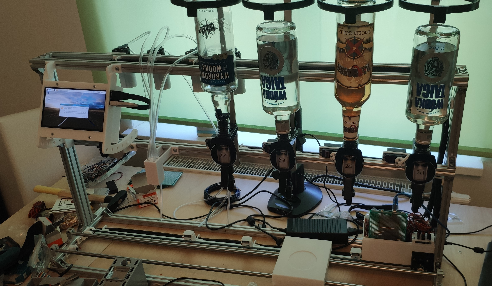

# Cocktail Robot

## pins

### relais.

- Relay 1: 28
- Relay 2: 26
- Relay 3: 24
- Relay 4: 22

### bumper:

- Start: 53
- Softdrinks: 51
- Alcohol 1: 49
- Alcohol 2: 47
- Alcohol 3: 45
- End: 43 (Also alcohol 4)

### stepper:

enable = 48;
direction = 50;
pulse = 52;

### servos:

int servo_1 = 23;
int servo_2 = 25;
int servo_3 = 27;
int servo_4 = 29;